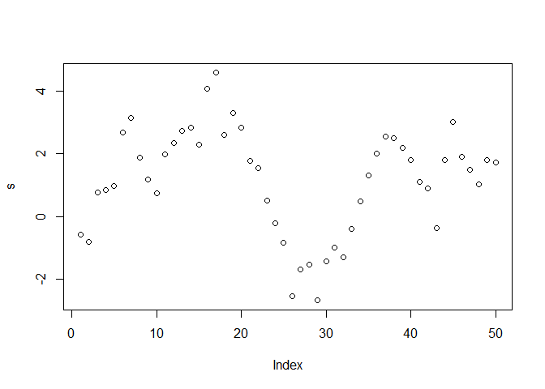

atsar (Applied Time Series Analysis in R)
=========================================

The atsar R package implements Bayesian time series models using Stan, primarily for illustrative purposes and teaching (University of Washington's Fish 507, Winter quarter 2017). The Stan webpage, and appropriate citation guidelines are [here](http://mc-stan.org/). You can cite the package as:

Citation: Ward, E.J., M.D. Scheuerell, and E.E. Holmes. 2018. 'atsar': Applied Time Series Analysis in R: an introduction to time series analysis for ecological and fisheries data with Stan. [](https://doi.org/10.5281/zenodo.1158021)

You can install the development version of the package with:

``` r
# install.packages("devtools")
devtools::install_github("nwfsc-timeseries/atsar")
```

An example model
----------------

Simulate data:

``` r
library(rstan)
#> Loading required package: ggplot2
#> Loading required package: StanHeaders
#> rstan (Version 2.16.2, packaged: 2017-07-03 09:24:58 UTC, GitRev: 2e1f913d3ca3)
#> For execution on a local, multicore CPU with excess RAM we recommend calling
#> rstan_options(auto_write = TRUE)
#> options(mc.cores = parallel::detectCores())
library(atsar)
#> Loading required package: Rcpp
#> Warning: package 'Rcpp' was built under R version 3.4.3
set.seed(123)
s = cumsum(rnorm(50))
```

``` r
plot(s)
```



Fit several models to this data:

``` r
# Regression, no slope
regression_model = fit_stan(y = s, x = model.matrix(lm(s~1)), model_name="regression")

# Regression, with slope
regression_model = fit_stan(y = s, x = model.matrix(lm(s~seq(1,length(s)))), model_name="regression")

# AR(1) time series model
ar1_model = fit_stan(y = s, est_drift=FALSE, P = 1, model_name = "ar")

# ARMA(1,1) time series model
arma1_model = fit_stan(y = s, model_name = "arma11")

# univariate ss model -- without drift but mean reversion estimated
ss_model = fit_stan(y = s, model_name = "ss_ar", est_drift=FALSE)
```

References
==========

The 507 class website is here, but will moved shortly because of transitions to Canvas.

[Fish 507 class website](https://catalyst.uw.edu/workspace/fish203/35553/243766)

Additional information can be found on our NWFSC time series page which includes several additional books and packages, [NWFSC time series page](https://nwfsc-timeseries.github.io/).
